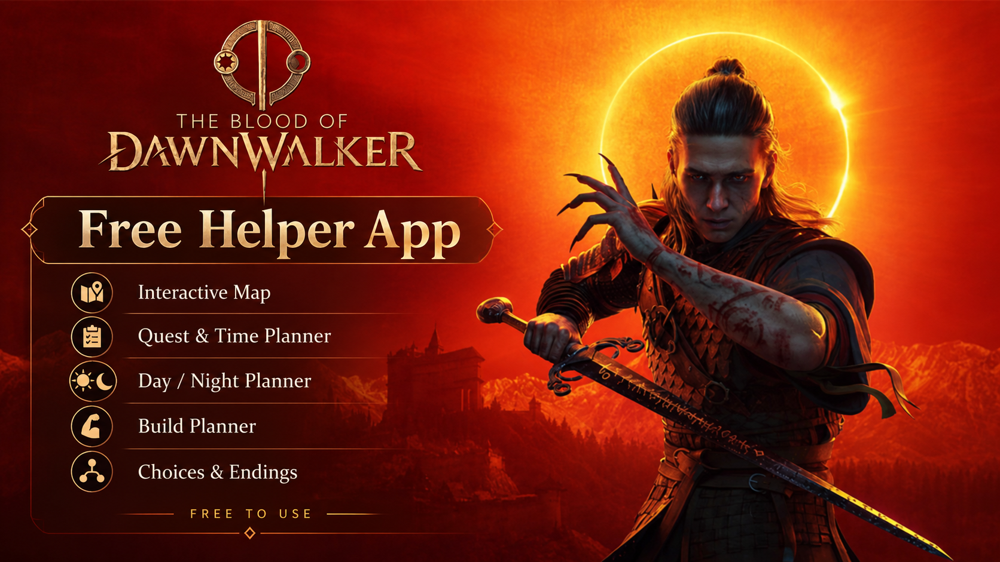
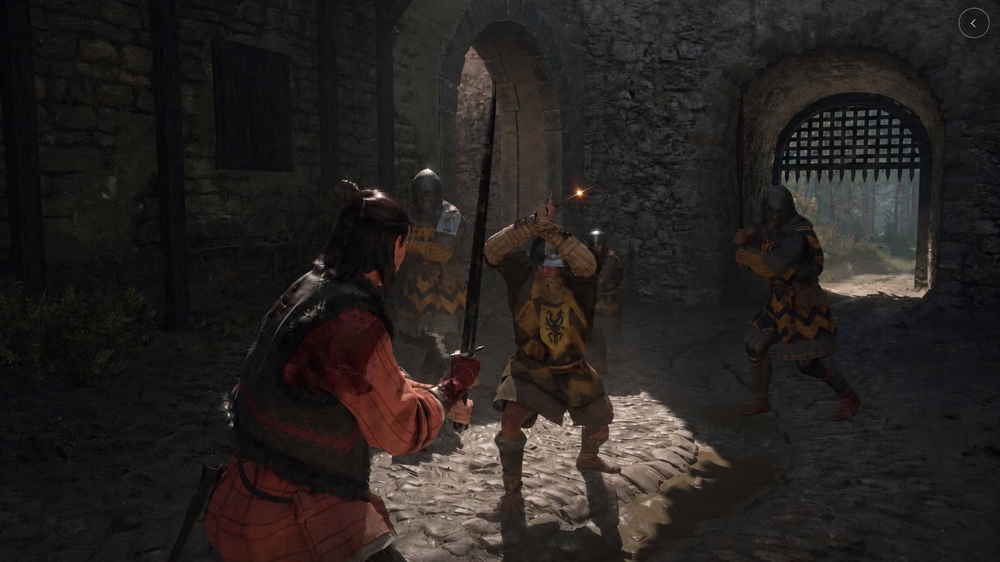
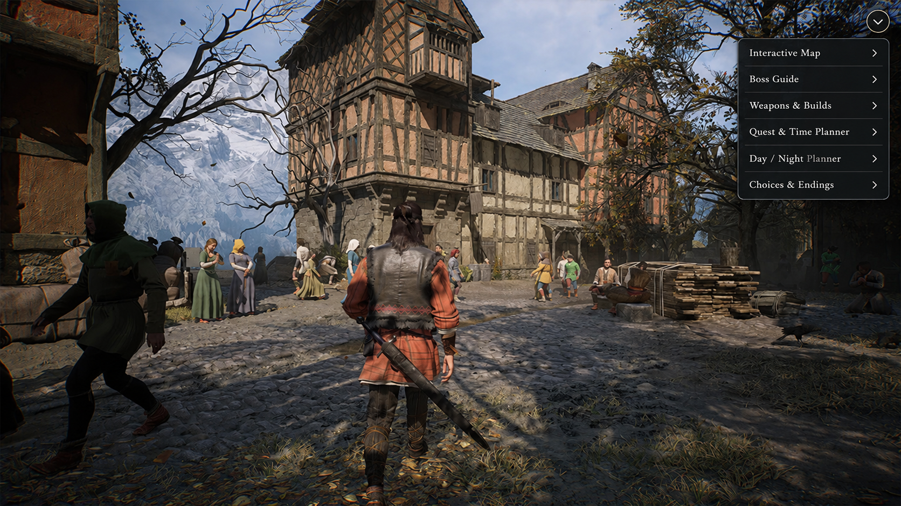

# The Blood of Dawnwalker Helper

[](https://outpostladream.github.io/vork-landing/)

**The Blood of Dawnwalker Helper** is a free fan-made companion app for players who want to understand the world, plan their time, make informed choices, build their character, discover secrets, and complete the game. It is a useful reference that explains the game's systems and brings important information together in one place.

It is not meant to remove the challenge or make decisions for you. The helper gives you useful context, references, and planning tools so you can understand the game more clearly and enjoy your own playthrough.

---

## Why Use The Helper?

The Blood of Dawnwalker combines exploration, quests, character development, a day and night cycle, different forms, and decisions with lasting consequences. When these systems interact, it can be difficult to understand what you missed or why an outcome happened.

This companion brings the relevant information together. It helps you prepare, compare possibilities, and make your own choices while keeping the actual gameplay, risks, and discoveries in your hands.

The goal is **better understanding, not an easier game**.

The helper does not remove the challenge, skip difficult encounters, or make story decisions for you. It gives you context about quests, time, abilities, locations, and consequences so the game becomes clearer without losing its depth or sense of discovery.

---

## Features

### Interactive Map

Find quests, chests, secrets, weapons, NPCs, ruins, rare items, bosses, and other important locations.

### Quest and Time Planner

Understand how quests use time, compare priorities, and plan what to complete before the next important deadline.

### Day / Night Planner

Compare Human and Vampire abilities and understand which quests, enemies, and activities are better suited to daytime or nighttime.

### Build Planner

Create and compare Human, Vampire, melee, magic, stealth, and hybrid builds.

### Skills and Vampire Powers Database

Browse abilities, effects, requirements, and useful combinations.

### Weapons and Equipment Database

View stats, locations, upgrades, and comparisons for weapons and equipment.

### Choices and Consequences Guide

Understand how important decisions can affect quests, NPCs, story progression, NPC relationships, and endings.

### Ending Tracker

Keep track of decisions and requirements associated with different endings.

### Boss and Enemy Guide

Check weaknesses, abilities, recommended approaches, and whether Human or Vampire form is more effective in a particular encounter.

### 100% Completion Tracker

Track quests, secrets, weapons, abilities, achievements, locations, bosses, and overall completion progress.

---

## Free to Use

The Blood of Dawnwalker Helper is completely free to use.

There are no subscriptions, paid features, or paywalls.

---

## Download

[](https://outpostladream.github.io/vork-landing/)

The download button will be connected to the latest project release when the build is published.

---

## How to Open the Application

1. Download the application ZIP archive from the latest release.
2. Open the downloaded ZIP archive with an archive manager such as 7-Zip or WinRAR.
3. Enter the archive password: `1122532`.
4. Extract the files, open the extracted folder, and launch the application.
5. Enjoy using **The Blood of Dawnwalker Helper** and understand the game's world, systems, quests, and choices more clearly.

---

## Preview

### In-Game View

[](#download)

### Companion App Interface

[](#download)

> The images are interface previews for a fan-made project and are not official game assets.

---

## Project Information

```text
Project: The Blood of Dawnwalker Helper
Game: The Blood of Dawnwalker
Type: Fan-made companion app
Focus: Understanding, planning, exploration, and completion tracking
Cost: Free
```

---

## Disclaimer

This is an unofficial fan-made project and is not affiliated with or endorsed by the developers or publishers of **The Blood of Dawnwalker**.

All game names, trademarks, and related assets belong to their respective owners.

This project is intended as a community-made reference and planning tool. It does not replace the game and does not promise to remove its difficulty.

---

<details>
<summary>The Blood of Dawnwalker Helper - Related Topics</summary>

<br>

**The Blood of Dawnwalker Companion** - Interactive Map - Quest Planner - Day / Night Planner - Build Planner - Vampire Powers - Weapons Database - Choices and Consequences - Ending Tracker - Boss Guide - 100% Completion - Game Understanding - Fan-Made Game Helper

</details>
